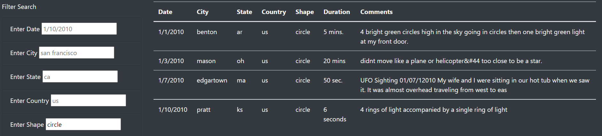

# UFO Sightings
## Project Overview
- This analysis project provides a visualizatoin of JavaScript data of UFO Sightings. This project creates a webpage with dynamic table allowing the user to filter a specific UFO sighting based on date, city, state, country, and shape.
    -  JavaScript, HTML, and CSS Bootstrap were utilzed in this project.

## Results/How-To
The user is able to type in specific criteria in the filter search section. When the information is typed in (one or more of the boxes), for the user to see the updated table, the user needs to either hit tab, hit enter, or click outside of the text box where they entered the typed information for the table to update. If the information typed does not exist in the data, no table will appear. Below is an image of filtered search based on shape, "circle" was typed into the shape search box.

## Summary/Recommendations
- Not having a filter button
    - Having a button for the user to click provides confirmation that all filters were included in filtering the data
- Adding a filter for duration for those who are interest looking at specific time durations of UFO sightings. 
- Adding a filter button for clearing the entire filter search would be convinient
- Having a keyword filter would be nice if looking for specific types of UFO sightings